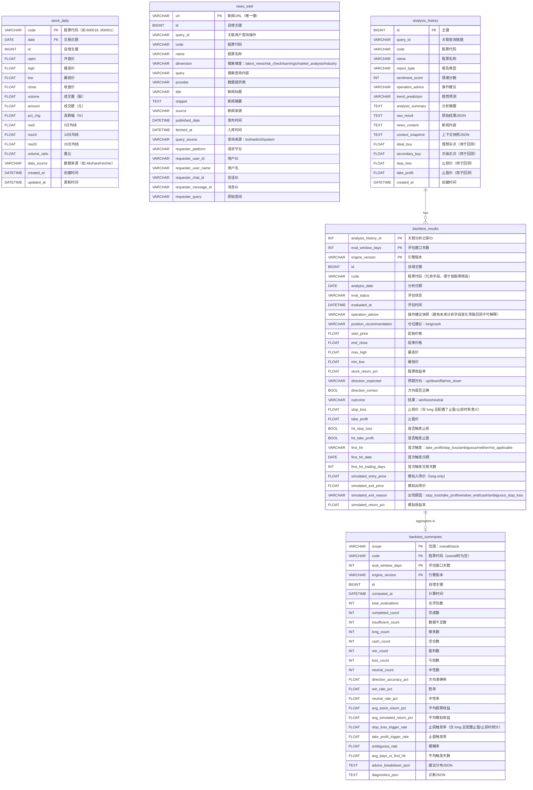

# 数据库ERD图 (实体关系图)

生成时间: 2026-02-16 10:18:20

## 表结构概览

本系统包含以下5个核心数据表：

| 表名 | 描述 | UNIQUE KEY |
|------|------|------------|
| stock_daily | 股票日线数据 | code + date |
| news_intel | 新闻情报数据 | url |
| analysis_history | 分析历史记录 | id (自增) |
| backtest_results | 回测结果 | analysis_history_id + eval_window_days + engine_version |
| backtest_summaries | 回测汇总 | scope + code + eval_window_days + engine_version |

## 实体关系图 (Mermaid)

## 表关系说明

### 1. stock_daily (股票日线数据)
- **UNIQUE KEY**: `code` + `date` (同一股票同一日期只有一条记录)
- **用途**: 存储每日行情数据和技术指标
- **字段说明**:
  - `code`: 股票代码（如 600519, 000001）
  - `date`: 交易日期
  - `open/high/low/close`: OHLC 开高低收价格
  - `volume`: 成交量（股）
  - `amount`: 成交额（元）
  - `pct_chg`: 涨跌幅（%）
  - `ma5/ma10/ma20`: 5/10/20日均线
  - `volume_ratio`: 量比
  - `data_source`: 数据来源（如 AkshareFetcher）

### 2. news_intel (新闻情报)
- **UNIQUE KEY**: `url` (按URL去重)
- **用途**: 存储搜索到的新闻情报
- **字段说明**:
  - `url`: 新闻URL（唯一键）
  - `query_id`: 关联用户查询操作
  - `code/name`: 股票代码/名称
  - `dimension`: 搜索维度（latest_news/risk_check/earnings/market_analysis/industry）
  - `query`: 搜索查询内容
  - `provider`: 数据提供商
  - `title/snippet/source`: 新闻标题/摘要/来源
  - `published_date`: 发布时间
  - `fetched_at`: 入库时间
  - `query_source`: 查询来源（bot/web/cli/system）
  - `requester_*`: 请求者相关信息（平台、用户ID、用户名、会话ID、消息ID、原始查询）

### 3. analysis_history (分析历史)
- **UNIQUE KEY**: `id` (自增)
- **索引**: `code` + `created_at`
- **用途**: 保存每次分析结果
- **字段说明**:
  - `id`: 主键
  - `query_id`: 关联查询链路
  - `code/name`: 股票代码/名称
  - `report_type`: 报告类型
  - `sentiment_score`: 情绪分数
  - `operation_advice`: 操作建议
  - `trend_prediction`: 趋势预测
  - `analysis_summary`: 分析摘要
  - `raw_result`: 原始结果JSON
  - `news_content`: 新闻内容
  - `context_snapshot`: 上下文快照JSON
  - `ideal_buy/secondary_buy`: 理想买点/次级买点（用于回测）
  - `stop_loss/take_profit`: 止损价/止盈价（用于回测）

### 4. backtest_results (回测结果)
- **UNIQUE KEY**: `analysis_history_id` + `eval_window_days` + `engine_version`
- **外键**: `analysis_history_id` -> `analysis_history.id`
- **用途**: 存储单条分析记录的回测结果
- **字段说明**:
  - `analysis_history_id`: 关联分析记录ID
  - `eval_window_days`: 评估窗口天数
  - `engine_version`: 引擎版本
  - `code`: 股票代码（冗余字段，便于按股票筛选）
  - `analysis_date`: 分析日期
  - `eval_status/evaluated_at`: 评估状态/时间
  - `operation_advice`: 操作建议快照（避免未来分析字段变化导致回测不可解释）
  - `position_recommendation`: 仓位建议（long/cash）
  - `start_price/end_close/max_high/min_low`: 价格数据
  - `stock_return_pct`: 股票收益率
  - `direction_expected`: 预期方向（up/down/flat/not_down）
  - `direction_correct`: 方向是否正确
  - `outcome`: 结果（win/loss/neutral）
  - `stop_loss/take_profit`: 止损价/止盈价（仅 long 且配置了止盈/止损时有意义）
  - `hit_stop_loss/hit_take_profit`: 是否触发止损/止盈
  - `first_hit`: 首次触发（take_profit/stop_loss/ambiguous/neither/not_applicable）
  - `first_hit_date/first_hit_trading_days`: 首次触发日期/交易天数
  - `simulated_entry_price/exit_price`: 模拟入场价/出场价（long-only）
  - `simulated_exit_reason`: 出场原因（stop_loss/take_profit/window_end/cash/ambiguous_stop_loss）
  - `simulated_return_pct`: 模拟收益率

### 5. backtest_summaries (回测汇总)
- **UNIQUE KEY**: `scope` + `code` + `eval_window_days` + `engine_version`
- **用途**: 存储按股票或全局的回测汇总指标
- **字段说明**:
  - `scope`: 范围（overall/stock）
  - `code`: 股票代码（overall时为空）
  - `eval_window_days`: 评估窗口天数
  - `engine_version`: 引擎版本
  - `computed_at`: 计算时间
  - `total_evaluations/completed_count/insufficient_count`: 总评估数/完成数/数据不足数
  - `long_count/cash_count`: 做多数/空仓数
  - `win_count/loss_count/neutral_count`: 盈利数/亏损数/中性数
  - `direction_accuracy_pct`: 方向准确率
  - `win_rate_pct/neutral_rate_pct`: 胜率/中性率
  - `avg_stock_return_pct/avg_simulated_return_pct`: 平均股票收益/平均模拟收益
  - `stop_loss_trigger_rate/take_profit_trigger_rate`: 止损触发率/止盈触发率（仅 long 且配置止盈/止损时统计）
  - `ambiguous_rate`: 模糊率
  - `avg_days_to_first_hit`: 平均触发天数
  - `advice_breakdown_json/diagnostics_json`: 建议分布JSON/诊断JSON

## Doris UNIQUE KEY 模型设计

迁移到Doris后，所有表使用UNIQUE KEY模型：

| 表名 | UNIQUE KEY字段 | 分布键(DISTRIBUTED BY) |
|------|----------------|------------------------|
| stock_daily | code, date | HASH(code) |
| news_intel | url | HASH(url) |
| analysis_history | id | HASH(id) |
| backtest_results | analysis_history_id, eval_window_days, engine_version | HASH(analysis_history_id) |
| backtest_summaries | scope, code, eval_window_days, engine_version | HASH(scope) |

## 注意事项

1. **字段顺序**: Doris UNIQUE KEY模型要求主键字段必须在表定义的最前面
2. **id字段处理**: 保留id字段但移至主键字段之后，类型改为BIGINT以支持AUTO_INCREMENT
3. **外键关系**: Doris不支持外键约束，应用层需要维护数据一致性
4. **分布键选择**: 分布键必须是UNIQUE KEY的一部分
5. **分区策略**: 可根据需要添加RANGE分区（如按日期分区）
