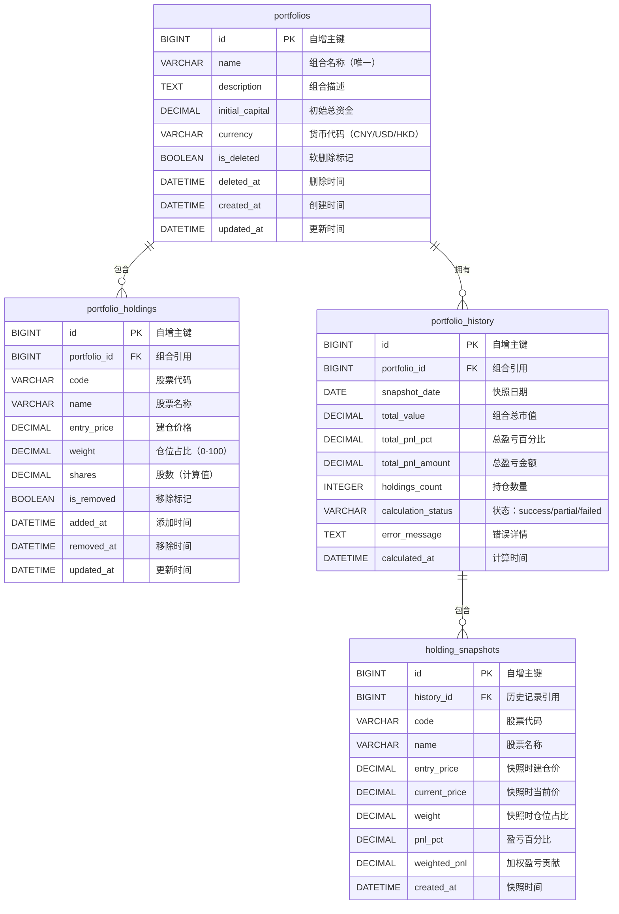

# 投资组合管理模块 - 需求规格说明书

**版本：** 1.0.0  
**最后更新：** 2026-02-17  
**状态：** 草稿

---

## 目录

1. [概述](#1-概述)
2. [功能需求](#2-功能需求)
3. [非功能需求](#3-非功能需求)
4. [数据字典](#4-数据字典)
5. [API接口规范](#5-api接口规范)
6. [业务规则](#6-业务规则)
7. [约束与假设](#7-约束与假设)

---

## 1. 概述

### 1.1 目的

投资组合管理模块使用户能够在现有股票分析系统中创建、管理和分析投资组合。它提供全面的组合收益追踪、自动每周计算以及历史收益的交互式可视化功能。

### 1.2 范围

| 包含范围 | 不包含范围 |
|---------|-----------|
| 组合增删改查操作 | 实时交易执行 |
| 持仓管理 | 券商集成 |
| 收益计算 | 税务报告 |
| 历史追踪 | 风险分析（VaR等） |
| 每周自动快照 | 多币种转换 |
| 数据导出 | 移动端原生应用 |

### 1.3 成功指标

| 指标 | 目标值 |
|-----|-------|
| 组合创建完成率 | > 95% |
| 每周计算成功率 | > 99% |
| 页面加载时间（P95） | < 800毫秒 |
| 用户满意度评分 | > 4.0/5.0 |

---

## 2. 功能需求

### 2.1 组合管理

#### FR-PM-001：创建组合

| 属性 | 描述 |
|-----|------|
| **优先级** | P0（关键） |
| **描述** | 用户能够创建新的投资组合并设置基本信息 |
| **验收标准** | 1. 用户可输入组合名称（必填，1-50字符）<br>2. 用户可输入描述（可选，最多500字符）<br>3. 用户可选择创建模式：手动或批量导入<br>4. 系统验证名称唯一性<br>5. 组合创建后状态为"活跃" |
| **依赖** | 无 |

#### FR-PM-002：手动添加持仓

| 属性 | 描述 |
|-----|------|
| **优先级** | P0（关键） |
| **描述** | 用户能够手动添加股票持仓到组合 |
| **验收标准** | 1. 用户可通过代码或名称搜索股票<br>2. 用户可设置建仓价格（必填，正数）<br>3. 用户可设置仓位占比（0-100%）<br>4. 系统验证仓位占比总和等于100%<br>5. 系统自动记录添加时间 |
| **依赖** | FR-PM-001 |

#### FR-PM-003：批量导入持仓

| 属性 | 描述 |
|-----|------|
| **优先级** | P1（高） |
| **描述** | 用户能够通过CSV文件批量导入持仓 |
| **验收标准** | 1. 系统仅接受CSV格式文件<br>2. 文件格式：code,entry_price,weight（可选）<br>3. 系统验证每行数据<br>4. 系统显示预览及验证结果<br>5. 用户可在导入前更正无效条目 |
| **依赖** | FR-PM-001 |

#### FR-PM-004：平均分配仓位

| 属性 | 描述 |
|-----|------|
| **优先级** | P1（高） |
| **描述** | 用户能够自动平均分配仓位占比 |
| **验收标准** | 1. 提供"平均分配"按钮<br>2. 系统计算100/n分配给每个持仓<br>3. 占比保留2位小数<br>4. 分配后总和等于100% |
| **依赖** | FR-PM-002 |

#### FR-PM-005：编辑组合

| 属性 | 描述 |
|-----|------|
| **优先级** | P0（关键） |
| **描述** | 用户能够修改组合信息和持仓 |
| **验收标准** | 1. 用户可修改组合名称和描述<br>2. 用户可新增持仓<br>3. 用户可移除已有持仓<br>4. 用户可修改建仓价格和仓位占比<br>5. 系统保存前验证变更 |
| **依赖** | FR-PM-001 |

#### FR-PM-006：软删除组合

| 属性 | 描述 |
|-----|------|
| **优先级** | P1（高） |
| **描述** | 用户能够软删除组合 |
| **验收标准** | 1. 删除操作显示确认对话框<br>2. 组合标记为已删除（is_deleted=true）<br>3. 历史数据保留<br>4. 已删除组合从默认列表隐藏<br>5. 提供永久删除历史记录选项 |
| **依赖** | FR-PM-001 |

#### FR-PM-007：恢复已删除组合

| 属性 | 描述 |
|-----|------|
| **优先级** | P2（中） |
| **描述** | 用户能够恢复软删除的组合 |
| **验收标准** | 1. 提供"显示已删除"开关<br>2. 已删除组合显示恢复选项<br>3. 恢复清除is_deleted标记<br>4. 组合返回活跃列表 |
| **依赖** | FR-PM-006 |

### 2.2 收益计算

#### FR-PC-001：实时盈亏计算

| 属性 | 描述 |
|-----|------|
| **优先级** | P0（关键） |
| **描述** | 系统能够计算每个持仓和组合总体的当前盈亏 |
| **验收标准** | 1. 盈亏% = (当前价格 - 建仓价格) / 建仓价格 * 100<br>2. 加权盈亏 = 盈亏% * 仓位占比 / 100<br>3. 总盈亏 = Σ(加权盈亏)<br>4. 价格刷新时自动更新计算 |
| **依赖** | 股票价格数据 |

#### FR-PC-002：每周自动计算

| 属性 | 描述 |
|-----|------|
| **优先级** | P0（关键） |
| **描述** | 系统能够每周自动计算并记录组合收益 |
| **验收标准** | 1. 每周五18:00执行（可配置）<br>2. 处理所有活跃组合<br>3. 为每个组合创建历史快照<br>4. 记录各持仓独立收益<br>5. 失败时优雅处理并重试 |
| **依赖** | 调度器、FR-PC-001 |

#### FR-PC-003：手动触发计算

| 属性 | 描述 |
|-----|------|
| **优先级** | P2（中） |
| **描述** | 用户能够手动触发组合计算 |
| **验收标准** | 1. 提供"立即计算"按钮<br>2. 对选定组合执行计算<br>3. 结果保存至历史记录<br>4. 完成后通知用户 |
| **依赖** | FR-PC-001 |

### 2.3 历史数据

#### FR-HD-001：组合历史记录

| 属性 | 描述 |
|-----|------|
| **优先级** | P0（关键） |
| **描述** | 系统能够维护组合收益的历史记录 |
| **验收标准** | 1. 每次每周计算创建历史记录<br>2. 记录包含：日期、总市值、总盈亏、持仓详情<br>3. 记录创建后不可修改<br>4. 组合删除后记录仍保留 |
| **依赖** | FR-PC-002 |

#### FR-HD-002：历史查询

| 属性 | 描述 |
|-----|------|
| **优先级** | P1（高） |
| **描述** | 用户能够查询历史收益数据 |
| **验收标准** | 1. 按组合ID查询<br>2. 按日期范围筛选<br>3. 分页返回结果<br>4. 包含组合级别和持仓级别数据 |
| **依赖** | FR-HD-001 |

### 2.4 可视化

#### FR-VZ-001：收益走势图

| 属性 | 描述 |
|-----|------|
| **优先级** | P1（高） |
| **描述** | 系统能够显示交互式收益走势图 |
| **验收标准** | 1. 折线图展示盈亏随时间变化<br>2. 可切换组合总体和各持仓独立视图<br>3. 时间范围选择器（1周/1月/3月/6月/1年/自定义）<br>4. 悬停显示详细数值<br>5. 支持缩放和平移 |
| **依赖** | FR-HD-002 |

#### FR-VZ-002：统计面板

| 属性 | 描述 |
|-----|------|
| **优先级** | P2（中） |
| **描述** | 系统能够显示收益统计信息 |
| **验收标准** | 1. 总收益率百分比<br>2. 最大回撤<br>3. 表现最佳持仓<br>4. 表现最差持仓<br>5. 平均持仓周期 |
| **依赖** | FR-HD-002 |

### 2.5 数据导出

#### FR-DE-001：导出组合数据

| 属性 | 描述 |
|-----|------|
| **优先级** | P2（中） |
| **描述** | 用户能够导出组合和收益数据 |
| **验收标准** | 1. 导出格式：CSV、JSON<br>2. 导出范围：摘要或详细记录<br>3. 可选择日期范围 |
| **依赖** | FR-HD-002 |

---

## 3. 非功能需求

### 3.1 性能需求

| 编号 | 需求 | 指标 | 目标值 |
|-----|------|-----|-------|
| NFR-P-001 | 组合列表页加载时间 | P95响应时间 | < 500毫秒 |
| NFR-P-002 | 组合详情页加载时间 | P95响应时间 | < 800毫秒 |
| NFR-P-003 | 创建组合操作 | 响应时间 | < 1秒 |
| NFR-P-004 | 更新持仓操作 | 响应时间 | < 800毫秒 |
| NFR-P-005 | 图表渲染时间 | 首次渲染 | < 2秒 |
| NFR-P-006 | 导出生成时间 | 文件生成 | < 5秒 |
| NFR-P-007 | 每周计算吞吐量 | 每分钟组合数 | > 100 |
| NFR-P-008 | 并发用户数 | 支持用户数 | 100 |

### 3.2 可扩展性需求

| 编号 | 需求 | 描述 |
|-----|------|------|
| NFR-S-001 | 组合数量限制 | 每用户最多10个组合 |
| NFR-S-002 | 持仓数量限制 | 每组合最多50个持仓 |
| NFR-S-003 | 历史保留期限 | 至少保留2年历史数据 |
| NFR-S-004 | 数据库增长 | 支持100万+历史记录 |

### 3.3 可靠性需求

| 编号 | 需求 | 指标 | 目标值 |
|-----|------|-----|-------|
| NFR-R-001 | 系统可用性 | 正常运行时间 | 99.5% |
| NFR-R-002 | 每周计算成功率 | 成功率 | 99% |
| NFR-R-003 | 数据持久性 | 零数据丢失 | 100% |
| NFR-R-004 | 错误恢复 | 自动重试 | 3次尝试 |

### 3.4 安全需求

| 编号 | 需求 | 描述 |
|-----|------|------|
| NFR-SEC-001 | 身份认证 | 所有组合操作需要身份认证 |
| NFR-SEC-002 | 输入验证 | 所有用户输入需验证和过滤 |
| NFR-SEC-003 | SQL注入防护 | 仅使用参数化查询 |
| NFR-SEC-004 | XSS防护 | 所有动态内容输出编码 |
| NFR-SEC-005 | CSRF防护 | 表单使用令牌防护 |
| NFR-SEC-006 | 审计日志 | 所有增删改操作记录用户ID和时间戳 |

### 3.5 易用性需求

| 编号 | 需求 | 描述 |
|-----|------|------|
| NFR-U-001 | 响应式设计 | 支持桌面（1280px+）和平板（768px+） |
| NFR-U-002 | 浏览器支持 | Chrome 90+、Firefox 88+、Safari 14+、Edge 90+ |
| NFR-U-003 | 无障碍 | 符合WCAG 2.1 AA级标准 |
| NFR-U-004 | 错误提示 | 清晰、可操作的错误信息 |
| NFR-U-005 | 帮助文档 | 应用内提示和帮助链接 |
| NFR-U-006 | 一致性UI | 遵循现有设计系统（深色主题、青色强调色） |

### 3.6 可维护性需求

| 编号 | 需求 | 描述 |
|-----|------|------|
| NFR-M-001 | 代码覆盖率 | 单元测试覆盖率至少80% |
| NFR-M-002 | 文档 | API文档使用OpenAPI规范 |
| NFR-M-003 | 日志 | 结构化日志，包含关联ID |
| NFR-M-004 | 监控 | 健康检查和指标端点 |

### 3.7 兼容性需求

| 编号 | 需求 | 描述 |
|-----|------|------|
| NFR-C-001 | 数据库 | 支持SQLite（开发）和Doris（生产） |
| NFR-C-002 | Python版本 | Python 3.10+ |
| NFR-C-003 | 框架 | 后端使用FastAPI，前端使用React |
| NFR-C-004 | 集成 | 与现有股票分析模块兼容 |

---

## 4. 数据字典

### 4.1 实体关系图



### 4.2 表定义

#### 4.2.1 portfolios（组合表）

| 字段 | 类型 | 约束 | 描述 |
|-----|------|-----|------|
| id | BIGINT | 主键，自增 | 主键 |
| name | VARCHAR(100) | 非空 | 组合名称 |
| description | TEXT | 可空 | 组合描述 |
| initial_capital | DECIMAL(18,4) | 可空 | 初始投资金额 |
| currency | VARCHAR(10) | 默认'CNY' | 货币代码 |
| is_deleted | BOOLEAN | 默认FALSE | 软删除标记 |
| deleted_at | DATETIME | 可空 | 删除时间 |
| created_at | DATETIME | 默认当前时间 | 创建时间 |
| updated_at | DATETIME | 更新时自动更新 | 更新时间 |

**索引：**
- `ix_portfolios_created` ON (created_at)
- `ix_portfolios_deleted` ON (is_deleted, deleted_at)

**Doris UNIQUE KEY：** (id)  
**Doris DISTRIBUTED BY：** HASH(id)

---

#### 4.2.2 portfolio_holdings（持仓表）

| 字段 | 类型 | 约束 | 描述 |
|-----|------|-----|------|
| id | BIGINT | 主键，自增 | 主键 |
| portfolio_id | BIGINT | 非空，外键 | 组合引用 |
| code | VARCHAR(20) | 非空 | 股票代码 |
| name | VARCHAR(100) | 可空 | 股票名称 |
| entry_price | DECIMAL(18,4) | 非空 | 建仓价格 |
| weight | DECIMAL(5,2) | 非空 | 仓位占比（0-100） |
| shares | DECIMAL(18,4) | 可空 | 股数 |
| is_removed | BOOLEAN | 默认FALSE | 移除标记 |
| added_at | DATETIME | 默认当前时间 | 添加时间 |
| removed_at | DATETIME | 可空 | 移除时间 |
| updated_at | DATETIME | 更新时自动更新 | 更新时间 |

**索引：**
- `ix_holdings_portfolio` ON (portfolio_id)
- `ix_holdings_code` ON (code)
- `uix_portfolio_code` UNIQUE ON (portfolio_id, code) WHERE is_removed = FALSE

**Doris UNIQUE KEY：** (portfolio_id, code)  
**Doris DISTRIBUTED BY：** HASH(portfolio_id)

---

#### 4.2.3 portfolio_history（历史记录表）

| 字段 | 类型 | 约束 | 描述 |
|-----|------|-----|------|
| id | BIGINT | 主键，自增 | 主键 |
| portfolio_id | BIGINT | 非空，外键 | 组合引用 |
| snapshot_date | DATE | 非空 | 快照日期 |
| total_value | DECIMAL(18,4) | 可空 | 组合总市值 |
| total_pnl_pct | DECIMAL(10,4) | 可空 | 总盈亏百分比 |
| total_pnl_amount | DECIMAL(18,4) | 可空 | 总盈亏金额 |
| holdings_count | INTEGER | 默认0 | 持仓数量 |
| calculation_status | VARCHAR(20) | 默认'pending' | 状态 |
| error_message | TEXT | 可空 | 错误详情 |
| calculated_at | DATETIME | 默认当前时间 | 计算时间 |

**索引：**
- `ix_history_portfolio_date` ON (portfolio_id, snapshot_date)
- `uix_portfolio_snapshot` UNIQUE ON (portfolio_id, snapshot_date)

**Doris UNIQUE KEY：** (portfolio_id, snapshot_date)  
**Doris DISTRIBUTED BY：** HASH(portfolio_id)

---

#### 4.2.4 holding_snapshots（持仓快照表）

| 字段 | 类型 | 约束 | 描述 |
|-----|------|-----|------|
| id | BIGINT | 主键，自增 | 主键 |
| history_id | BIGINT | 非空，外键 | 历史记录引用 |
| code | VARCHAR(20) | 非空 | 股票代码 |
| name | VARCHAR(100) | 可空 | 股票名称 |
| entry_price | DECIMAL(18,4) | 非空 | 快照时建仓价 |
| current_price | DECIMAL(18,4) | 可空 | 快照时当前价 |
| weight | DECIMAL(5,2) | 非空 | 快照时仓位占比 |
| pnl_pct | DECIMAL(10,4) | 可空 | 盈亏百分比 |
| weighted_pnl | DECIMAL(10,4) | 可空 | 加权盈亏贡献 |
| created_at | DATETIME | 默认当前时间 | 快照时间 |

**索引：**
- `ix_snapshots_history` ON (history_id)
- `ix_snapshots_code` ON (code)

**Doris UNIQUE KEY：** (id)  
**Doris DISTRIBUTED BY：** HASH(history_id)

---

### 4.3 数据验证规则

| 字段 | 规则 | 错误信息 |
|-----|------|---------|
| portfolio.name | 必填，1-100字符 | "组合名称必须为1-100个字符" |
| portfolio.name | 唯一 | "组合名称已存在" |
| portfolio.initial_capital | 如填写必须为正数 | "初始资金必须为正数" |
| holding.code | 有效股票代码格式 | "股票代码格式无效" |
| holding.entry_price | 必填，正数 | "建仓价格必须为正数" |
| holding.weight | 0.01 - 100.00 | "仓位占比必须在0.01到100之间" |
| holding.weight（总和） | 必须等于100% | "仓位占比总和必须等于100%" |

---

## 5. API接口规范

### 5.1 接口概览

| 方法 | 端点 | 描述 |
|-----|------|------|
| POST | /api/v1/portfolios | 创建组合 |
| GET | /api/v1/portfolios | 获取组合列表 |
| GET | /api/v1/portfolios/{id} | 获取组合详情 |
| PUT | /api/v1/portfolios/{id} | 更新组合信息 |
| DELETE | /api/v1/portfolios/{id} | 删除组合 |
| POST | /api/v1/portfolios/{id}/restore | 恢复已删除组合 |
| POST | /api/v1/portfolios/{id}/holdings | 添加持仓 |
| PUT | /api/v1/portfolios/{id}/holdings/{holding_id} | 更新持仓 |
| DELETE | /api/v1/portfolios/{id}/holdings/{holding_id} | 移除持仓 |
| POST | /api/v1/portfolios/{id}/holdings/batch | 批量添加持仓 |
| POST | /api/v1/portfolios/{id}/holdings/rebalance | 平均分配仓位 |
| POST | /api/v1/portfolios/{id}/calculate | 触发计算 |
| GET | /api/v1/portfolios/{id}/history | 获取历史记录 |
| GET | /api/v1/portfolios/{id}/performance | 获取收益走势数据 |
| GET | /api/v1/portfolios/{id}/export | 导出数据 |

### 5.2 接口详细定义

#### 5.2.1 创建组合

**POST** `/api/v1/portfolios`

**请求体：**

```json
{
  "name": "科技成长组合",
  "description": "高成长科技股组合",
  "initial_capital": 100000.00,
  "currency": "CNY",
  "holdings": [
    {
      "code": "600519",
      "entry_price": 1800.00,
      "weight": 50.00
    },
    {
      "code": "00700",
      "entry_price": 350.00,
      "weight": 50.00
    }
  ]
}
```

**请求参数说明：**

| 参数 | 类型 | 必填 | 描述 |
|-----|------|-----|------|
| name | string | 是 | 组合名称，1-100字符 |
| description | string | 否 | 组合描述，最多500字符 |
| initial_capital | number | 否 | 初始资金，正数 |
| currency | string | 否 | 货币代码，默认CNY |
| holdings | array | 否 | 初始持仓列表 |
| holdings[].code | string | 是 | 股票代码 |
| holdings[].entry_price | number | 是 | 建仓价格，正数 |
| holdings[].weight | number | 是 | 仓位占比，0-100 |

**响应（201 Created）：**

```json
{
  "id": 1,
  "name": "科技成长组合",
  "description": "高成长科技股组合",
  "initial_capital": 100000.00,
  "currency": "CNY",
  "is_deleted": false,
  "created_at": "2026-02-17T10:00:00Z",
  "updated_at": "2026-02-17T10:00:00Z",
  "holdings": [
    {
      "id": 1,
      "code": "600519",
      "name": "贵州茅台",
      "entry_price": 1800.00,
      "current_price": 1850.00,
      "weight": 50.00,
      "pnl_pct": 2.78,
      "weighted_pnl": 1.39,
      "added_at": "2026-02-17T10:00:00Z"
    }
  ],
  "summary": {
    "total_value": 102780.00,
    "total_pnl_pct": 2.78,
    "total_pnl_amount": 2780.00,
    "holdings_count": 2
  }
}
```

**错误响应：**

| 状态码 | 错误代码 | 描述 |
|-------|---------|------|
| 400 | PORTFOLIO_001 | 组合名称为空 |
| 400 | PORTFOLIO_003 | 组合名称已存在 |
| 400 | PORTFOLIO_005 | 仓位占比总和不为100% |
| 400 | HOLDING_001 | 股票代码无效 |

---

#### 5.2.2 获取组合列表

**GET** `/api/v1/portfolios`

**查询参数：**

| 参数 | 类型 | 必填 | 默认值 | 描述 |
|-----|------|-----|-------|------|
| include_deleted | boolean | 否 | false | 是否包含已删除组合 |
| page | integer | 否 | 1 | 页码 |
| limit | integer | 否 | 20 | 每页数量（最大100） |

**响应（200 OK）：**

```json
{
  "items": [
    {
      "id": 1,
      "name": "科技成长组合",
      "description": "高成长科技股组合",
      "holdings_count": 5,
      "total_value": 102500.00,
      "total_pnl_pct": 2.50,
      "total_pnl_amount": 2500.00,
      "is_deleted": false,
      "created_at": "2026-02-17T10:00:00Z",
      "updated_at": "2026-02-17T12:00:00Z"
    }
  ],
  "total": 3,
  "page": 1,
  "limit": 20
}
```

---

#### 5.2.3 获取组合详情

**GET** `/api/v1/portfolios/{id}`

**路径参数：**

| 参数 | 类型 | 描述 |
|-----|------|------|
| id | integer | 组合ID |

**响应（200 OK）：**

```json
{
  "id": 1,
  "name": "科技成长组合",
  "description": "高成长科技股组合",
  "initial_capital": 100000.00,
  "currency": "CNY",
  "is_deleted": false,
  "created_at": "2026-02-17T10:00:00Z",
  "updated_at": "2026-02-17T12:00:00Z",
  "holdings": [
    {
      "id": 1,
      "code": "600519",
      "name": "贵州茅台",
      "entry_price": 1800.00,
      "current_price": 1890.00,
      "weight": 50.00,
      "pnl_pct": 5.00,
      "weighted_pnl": 2.50,
      "is_removed": false,
      "added_at": "2026-02-17T10:00:00Z"
    }
  ],
  "summary": {
    "total_value": 102500.00,
    "total_pnl_pct": 2.50,
    "total_pnl_amount": 2500.00,
    "holdings_count": 2,
    "best_performer": {
      "code": "600519",
      "name": "贵州茅台",
      "pnl_pct": 5.00
    },
    "worst_performer": {
      "code": "00700",
      "name": "腾讯控股",
      "pnl_pct": -2.86
    }
  }
}
```

**错误响应：**

| 状态码 | 错误代码 | 描述 |
|-------|---------|------|
| 404 | PORTFOLIO_NOT_FOUND | 组合不存在 |

---

#### 5.2.4 更新组合信息

**PUT** `/api/v1/portfolios/{id}`

**请求体：**

```json
{
  "name": "科技成长组合（更新）",
  "description": "调整后的科技股组合",
  "initial_capital": 120000.00
}
```

**响应（200 OK）：** 返回更新后的完整组合对象

---

#### 5.2.5 删除组合

**DELETE** `/api/v1/portfolios/{id}`

**查询参数：**

| 参数 | 类型 | 必填 | 默认值 | 描述 |
|-----|------|-----|-------|------|
| delete_history | boolean | 否 | false | 是否同时删除历史记录 |

**响应（200 OK）：**

```json
{
  "id": 1,
  "name": "科技成长组合",
  "is_deleted": true,
  "deleted_at": "2026-02-17T14:00:00Z",
  "history_preserved": true
}
```

---

#### 5.2.6 恢复已删除组合

**POST** `/api/v1/portfolios/{id}/restore`

**响应（200 OK）：** 返回恢复后的完整组合对象

---

#### 5.2.7 添加持仓

**POST** `/api/v1/portfolios/{id}/holdings`

**请求体：**

```json
{
  "code": "AAPL",
  "entry_price": 180.00,
  "weight": 10.00
}
```

**响应（201 Created）：** 返回新创建的持仓对象

---

#### 5.2.8 更新持仓

**PUT** `/api/v1/portfolios/{id}/holdings/{holding_id}`

**请求体：**

```json
{
  "entry_price": 185.00,
  "weight": 15.00
}
```

**响应（200 OK）：** 返回更新后的持仓对象

---

#### 5.2.9 移除持仓

**DELETE** `/api/v1/portfolios/{id}/holdings/{holding_id}`

**响应（200 OK）：**

```json
{
  "id": 1,
  "code": "AAPL",
  "is_removed": true,
  "removed_at": "2026-02-17T14:00:00Z"
}
```

---

#### 5.2.10 批量添加持仓

**POST** `/api/v1/portfolios/{id}/holdings/batch`

**请求体：**

```json
{
  "holdings": [
    {
      "code": "600519",
      "entry_price": 1800.00,
      "weight": 30.00
    },
    {
      "code": "00700",
      "entry_price": 350.00,
      "weight": 20.00
    }
  ],
  "rebalance_mode": "none"
}
```

**请求参数说明：**

| 参数 | 类型 | 必填 | 描述 |
|-----|------|-----|------|
| holdings | array | 是 | 持仓列表 |
| rebalance_mode | string | 否 | 重平衡模式：none/equal/keep_existing |

**响应（200 OK）：**

```json
{
  "added_count": 2,
  "skipped_count": 0,
  "holdings": [
    {
      "id": 5,
      "code": "600519",
      "name": "贵州茅台",
      "entry_price": 1800.00,
      "weight": 30.00
    }
  ],
  "weight_summary": {
    "total": 100.00,
    "is_valid": true
  }
}
```

---

#### 5.2.11 平均分配仓位

**POST** `/api/v1/portfolios/{id}/holdings/rebalance`

**响应（200 OK）：**

```json
{
  "portfolio_id": 1,
  "holdings_count": 5,
  "new_weight_each": 20.00,
  "holdings": [
    {
      "id": 1,
      "code": "600519",
      "weight": 20.00
    }
  ]
}
```

---

#### 5.2.12 触发计算

**POST** `/api/v1/portfolios/{id}/calculate`

**响应（200 OK）：**

```json
{
  "portfolio_id": 1,
  "calculated_at": "2026-02-17T15:00:00Z",
  "snapshot_date": "2026-02-17",
  "total_value": 102500.00,
  "total_pnl_pct": 2.50,
  "holdings_updated": 5,
  "status": "success"
}
```

---

#### 5.2.13 获取历史记录

**GET** `/api/v1/portfolios/{id}/history`

**查询参数：**

| 参数 | 类型 | 必填 | 默认值 | 描述 |
|-----|------|-----|-------|------|
| start_date | string | 否 | 30天前 | 开始日期（YYYY-MM-DD） |
| end_date | string | 否 | 今天 | 结束日期（YYYY-MM-DD） |
| page | integer | 否 | 1 | 页码 |
| limit | integer | 否 | 20 | 每页数量 |

**响应（200 OK）：**

```json
{
  "portfolio_id": 1,
  "items": [
    {
      "id": 1,
      "snapshot_date": "2026-02-14",
      "total_value": 102500.00,
      "total_pnl_pct": 2.50,
      "total_pnl_amount": 2500.00,
      "holdings_count": 5,
      "calculation_status": "success",
      "calculated_at": "2026-02-14T18:00:00Z",
      "holdings": [
        {
          "code": "600519",
          "name": "贵州茅台",
          "entry_price": 1800.00,
          "current_price": 1845.00,
          "weight": 50.00,
          "pnl_pct": 2.50,
          "weighted_pnl": 1.25
        }
      ]
    }
  ],
  "total": 10,
  "page": 1,
  "limit": 20
}
```

---

#### 5.2.14 获取收益走势数据

**GET** `/api/v1/portfolios/{id}/performance`

**查询参数：**

| 参数 | 类型 | 必填 | 默认值 | 描述 |
|-----|------|-----|-------|------|
| start_date | string | 否 | 30天前 | 开始日期 |
| end_date | string | 否 | 今天 | 结束日期 |
| view_mode | string | 否 | portfolio | 视图模式：portfolio/holdings |

**响应（200 OK）：**

```json
{
  "portfolio_id": 1,
  "view_mode": "portfolio",
  "date_range": {
    "start": "2026-01-17",
    "end": "2026-02-17"
  },
  "data_points": [
    {
      "date": "2026-02-14",
      "total_value": 102500.00,
      "total_pnl_pct": 2.50,
      "holdings": {
        "600519": {
          "pnl_pct": 2.50,
          "weighted_pnl": 1.25
        }
      }
    }
  ],
  "statistics": {
    "total_return_pct": 2.50,
    "max_drawdown_pct": -1.20,
    "best_day": {
      "date": "2026-02-10",
      "pnl_pct": 1.50
    },
    "worst_day": {
      "date": "2026-02-05",
      "pnl_pct": -0.80
    }
  }
}
```

---

#### 5.2.15 导出数据

**GET** `/api/v1/portfolios/{id}/export`

**查询参数：**

| 参数 | 类型 | 必填 | 默认值 | 描述 |
|-----|------|-----|-------|------|
| format | string | 否 | csv | 导出格式：csv/json |
| scope | string | 否 | summary | 数据范围：summary/detailed |
| start_date | string | 否 | 全部 | 开始日期 |
| end_date | string | 否 | 全部 | 结束日期 |

**响应：**
- CSV格式：返回文件下载
- JSON格式：返回JSON数据

---

### 5.3 通用错误响应格式

```json
{
  "error": {
    "code": "PORTFOLIO_001",
    "message": "请输入组合名称",
    "details": {
      "field": "name",
      "constraint": "required"
    }
  }
}
```

---

## 6. 业务规则

### 6.1 组合规则

| 规则ID | 规则描述 | 实现方式 |
|-------|---------|---------|
| BR-P-001 | 每用户最多10个组合 | 创建前检查数量 |
| BR-P-002 | 组合名称必须唯一 | 唯一约束+验证 |
| BR-P-003 | 组合至少包含1个持仓 | 保存前验证 |
| BR-P-004 | 已删除组合默认隐藏 | 过滤is_deleted=false |
| BR-P-005 | 删除时保留历史记录 | 不应用级联删除 |

### 6.2 持仓规则

| 规则ID | 规则描述 | 实现方式 |
|-------|---------|---------|
| BR-H-001 | 每组合最多50个持仓 | 添加前检查数量 |
| BR-H-002 | 仓位占比总和必须等于100% | 保存时验证 |
| BR-H-003 | 同一股票不能重复添加 | (portfolio_id, code)唯一约束 |
| BR-H-004 | 建仓价格必须为正数 | 输入验证 |
| BR-H-005 | 移除持仓使用软删除 | 设置is_removed=true |

### 6.3 计算规则

| 规则ID | 规则描述 | 实现方式 |
|-------|---------|---------|
| BR-C-001 | 每周五执行计算 | Cron: 0 18 * * 5 |
| BR-C-002 | 仅计算活跃组合 | 过滤is_deleted=false |
| BR-C-003 | 失败计算重试3次 | 带退避的重试逻辑 |
| BR-C-004 | 历史记录不可修改 | 历史表无更新/删除操作 |
| BR-C-005 | 每组合每天一个快照 | 唯一约束 |

---

## 7. 约束与假设

### 7.1 技术约束

| 约束 | 描述 |
|-----|------|
| 数据库 | 必须同时支持SQLite和Doris |
| 框架 | 必须与现有FastAPI后端集成 |
| 前端 | 必须遵循现有React + Tailwind设计系统 |
| 认证 | 使用现有会话/令牌管理 |

### 7.2 业务约束

| 约束 | 描述 |
|-----|------|
| 单用户模式 | 无多用户协作功能 |
| 仅追踪 | 组合仅用于追踪，不执行交易 |
| 手动价格 | 价格按需获取，非实时推送 |

### 7.3 假设

| 假设 | 描述 |
|-----|------|
| 股票代码有效 | 系统假设提供的代码存在于市场数据中 |
| 价格可获取 | 历史价格可从数据提供商获取 |
| 用户已认证 | 所有API调用包含有效认证 |
| 每周频率足够 | 用户不需要更频繁的计算 |

---

## 附录A：术语表

| 术语 | 定义 |
|-----|------|
| 组合 | 作为一组追踪的投资持仓集合 |
| 持仓 | 组合中的单只股票头寸 |
| 建仓价格 | 股票加入组合时的价格 |
| 仓位占比 | 持仓在组合中的百分比配置 |
| 盈亏 | 盈利与亏损，以建仓价格为基准计算的百分比变化 |
| 软删除 | 将记录标记为已删除但不从数据库中移除 |
| 快照 | 特定时间点的组合状态和收益记录 |
| 加权盈亏 | 持仓盈亏对组合总盈亏的贡献度 |

---

## 附录B：修订历史

| 版本 | 日期 | 作者 | 变更内容 |
|-----|------|------|---------|
| 1.0.0 | 2026-02-17 | 系统 | 初始版本 |
